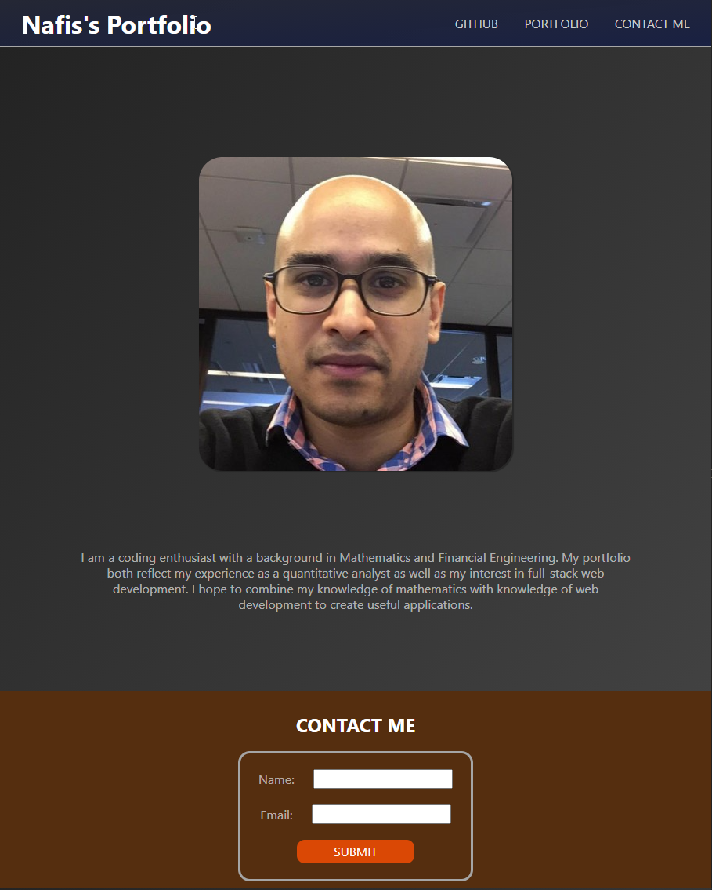

# Unit 01 Mini-Project: Landing Page

This is a landing page that contains Nafis Rahman's coding profile. It is intended to showcase his portfolio of work and capture the contact information of anyone wanting to reach out to him.

## Acceptance Criteria

* It's done when the page uses semantic HTML elements.

* It's done when the page uses universal, element, and class selectors in CSS.

* It's done when the page features at least three colors in the design.

* It's done when the page uses a single font and font family for all text.

* It's done when the page uses at least two heading elements (`<h1>` through `<h6>`).

* It's done when the header is fixed to the top of the page on scroll.

* It's done when the header contains a navigation bar with three links that display inline, including a contact link.

* It's done when, if the contact link is clicked, the page jumps directly to the contact form.

* It's done when the contact form includes `input` elements for name and email.

* It's done when the contact form includes a Send button.

* It's done when the image includes a descriptive `alt` attribute.

* It's done when the page is deployed to GitHub Pages.

## Usage

This page contains a heading with links to:
* Github Repository
* Github Profile
* Contact Me

The main section contains a profile picture of Nafis Rahman followed by a small biography about his educational background.

The footer contains a form that can be filled out that contains the users:
* Name
* Email Address

